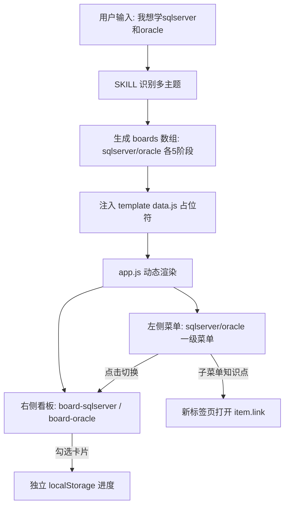

## 产品概述

study-kanban 是一个 CodeBuddy 技能，根据用户输入（链接 / 主题描述 / 粘贴素材）自动生成自包含、可双击打开的 HTML 学习看板，采用固定五阶段框架（入门→基础→进阶→实战→精通），每个知识点带「通俗讲解」字段，支持多主题菜单切换，视觉与 WorkBuddy 学习看板 1:1 一致。

## 核心功能

- 双输入兼容：识别链接（走抓取）与文字（主题或素材）两种输入，统一汇入固定五阶段结构
- 多主题菜单切换：多个学习主题时左侧生成一级菜单，点击切换右侧对应看板，子菜单保留各知识点链接
- 小白友好讲解：每个知识点必填「通俗讲解」字段，用大白话解释，渲染在描述与验收标准之间
- 进度隔离：每个看板使用独立 localStorage key，互不干扰
- 单主题退化：仅一个主题时隐藏切换菜单，退化为单看板
- 模板保持「未填充」约束：仅含占位符，生成时由工作流注入，绝不硬编码示例数据

## 技术栈

- 技能定义：Markdown（SKILL.md frontmatter + 工作流）
- 模板技术：原生 HTML + CSS + 原生 JavaScript（无框架，保证自包含、双击可开）
- 数据载体：单文件 `js/data.js` 注入 `const boards = __BOARDS_DATA__;` 占位符
- 进度持久化：localStorage（每个 board 独立 key `study_kanban_progress_<board.id>`）
- 视觉规范：与 WorkBuddy 1:1 一致（复用其 design token 与布局结构作为参考基线）

## 实现方案

### 总体策略

以 SKILL.md 规范为唯一事实来源，改造 `template/` 三件套（index.html / js/app.js / css/style.css / js/data.js），使其真正落地文档中已声明但当前未实现的能力：占位符注入、左侧多主题动态菜单、explain 字段渲染、进度按 board.id 隔离、单主题退化。参考 `WorkBuddy/` 已验证的 BOARDS 配置驱动 + switchBoard + scrollSync 实现模式，避免重复造轮子。

### 关键技术决策

- **占位符对齐**：`template/index.html` 还原 `__BOARD_TITLE__`（`<title>` 与 `.header-left h1`）与 `__BOARD_SUBTITLE__`（`.header-left p`）占位符；`template/js/data.js` 还原为 `const boards = __BOARDS_DATA__;`。恢复 SKILL.md 第 252-258 行「模板默认未填充」约束，使 Step 4 注入流程可被执行。
- **多主题菜单落地**：`template/index.html` 新增 `#menuGroupsContainer`（左侧动态菜单区）与 `#boardsContainer`（多 board 渲染区）；`template/js/app.js` 重写或补齐 `renderMenuGroups` / `switchBoard` / `toggleMenuGroup` / `refreshMenuLinkStates`，从 `boards` 动态生成一级菜单（每 board 一个）与子菜单（5 阶段 → 知识点链接，点击新标签页打开 `item.link`）。单主题（`boards.length<=1`）时隐藏菜单区。
- **explain 渲染**：`template/js/app.js` 卡片渲染在 `desc` 与 `验收标准` 之间条件插入 explain 区块（`item.explain` 存在才显示），沿用 `escapeHtml` 防止注入；`template/css/style.css` 补齐 `.card-explain` 引用样式（浅灰底 + 左侧阶段色边 + 小字号）。
- **进度隔离**：`template/js/app.js` 改为 `study_kanban_progress_${board.id}` 存储 key 与 `${board.id}-` 前缀，彻底避免多主题互相覆盖。
- **输出路径修正**：SKILL.md Step 4 将绝对路径 `c:/Users/Administrator/code/KanbanSPA/study-kanban/output/<slug>/` 改为相对/可配置描述（如「输出到用户指定目录，或 skill 目录外的 `output/<slug>/`」），避免指向已不存在的绝对目录。
- **1:1 视觉对齐**：对照 `WorkBuddy/css/style.css` 补齐 `.menu-link`、`.menu-group`、`.progress-circle` 初始 conic-gradient、`.board` 横向滚动容器等，确保视觉 token（渐变、列宽、卡片高度、浅底深字标签）一致。

### 性能与可靠性

- 渲染复杂度 O(boards × stages × items)，规模可控（一般 ≤5 主题 ×5 阶段 ×20 项），无额外网络请求。
- 复用现有 `escapeHtml` / `safeLink`（仅允许 http/https）防止 XSS。
- 进度 key 按 board.id 隔离，向后兼容新生成文件（旧单看板数据 key 不再兼容，但生成流程保证总是新结构）。
- 模板「未填充」约束必须保持：仅还原占位符，绝不硬编码 demo 数据。

## 实现注意事项

- `template/js/data.js` 仅还原占位符 `const boards = __BOARDS_DATA__;` 并补全 boards 结构注释（含 explain 字段说明），不得填入示例数据。
- `template/index.html` 占位符 `__BOARD_TITLE__` / `__BOARD_SUBTITLE__` 保留；新增的菜单/看板容器由 app.js 渲染，HTML 不写死看板结构。
- `template/css/style.css` 只增量补齐缺失样式（菜单、explain、进度环初始态），不改动既有 token。
- `template/js/app.js` 需向后兼容：无 `boards` 变量时不应报错——生成流程保证总是输出 boards 结构。
- SKILL.md 第 217 行输出路径改为相对/可配置，避免无效绝对路径；其余工作流描述与约束保持。

## 架构设计

当前单看板数据流升级为：用户输入 → SKILL 工作流（识别多主题 → 拆分为 N 个 board 的 stages）→ 注入 template 的 `boards` → app.js 动态生成菜单组 + 多看板 → 渲染 columns/cards（含 explain）→ 浏览器展示 + 按 board.id 独立 localStorage 进度。



## 目录结构

```
.codebuddy/skills/study-kanban/
├── SKILL.md                          # [MODIFY] 修正输出路径为相对/可配置；确保工作流与模板实际能力一致（占位符、菜单、explain、进度隔离）
├── template/
│   ├── index.html                    # [MODIFY] 还原 __BOARD_TITLE__/__BOARD_SUBTITLE__ 占位符；新增 #menuGroupsContainer 与 #boardsContainer 容器
│   ├── css/style.css                 # [MODIFY] 增量补齐 .menu-link / .menu-group / .card-explain / progress-circle 初始态等，对齐 WorkBuddy
│   └── js/
│       ├── data.js                   # [MODIFY] 还原占位符 const boards = __BOARDS_DATA__；补全 boards 结构注释（含 explain）
│       └── app.js                    # [MODIFY] 补齐 renderMenuGroups/switchBoard/toggleMenuGroup；卡片渲染 explain；进度 key 改 study_kanban_progress_<id>；单主题隐藏菜单
└── output/_example/
    └── js/data.js                    # [参考] 已是正确 boards + explain 示例，可反哺模板注释（不强制改）
```

## 设计风格

沿用 WorkBuddy 学习看板既有视觉语言（蓝色渐变 header、可折叠侧边栏、玻璃拟态进度环、浅底深字 type 标签、横向滚动知识卡列），本次补齐「左侧多主题动态菜单」与「通俗讲解」区块样式，整体保持 1:1 一致。

## 页面区块设计（单页看板 + 多主题菜单）

- 左侧侧边栏（补齐重点）：顶部 Logo + 标题；动态菜单区 `#menuGroupsContainer`（每个主题为一组 .menu-group，组头显示主题名，展开后显示 5 个阶段，每阶段下挂知识点链接 .menu-link，点击新标签页打开）；「操作」分组（返回顶部 / 重置进度）；折叠按钮。
- 主区域：蓝紫渐变 header（标题+副标题+进度环）、图例行、阶段胶囊工具栏（全选/重置）、横向滚动看板列。
- 知识卡片：勾选框+标题 → type 标签 → 一句话描述 → 通俗讲解（浅灰引用块，左侧阶段色边）→ 验收标准（左侧色块）→ 查看文档链接。
- 多主题时：点击左侧不同主题组头，右侧看板平滑切换（其他 board 隐藏），header 标题/副标题同步更新，左侧子菜单自动同步为当前主题知识点。
- 单主题时：左侧仅显示一个主题组（或隐藏切换），体验与单看板一致。

## 交互

- 主题组头点击 → switchBoard（互斥展开 + 看板互斥显示 + 头部更新）
- 阶段箭头点击 → 仅折叠/展开该组子菜单（toggleMenuGroup，互斥）
- 知识点链接 → 新标签页打开 item.link
- 卡片勾选 → 更新当前 board 独立进度环

## Agent Extensions

### Skill

- **skill-creator**
- Purpose: 参考该技能关于「如何编写/更新有效 skill」的规范，确保改造后的 SKILL.md 的 frontmatter、description 触发语、工作流描述与模板实际能力严格一致、结构合规。
- Expected outcome: SKILL.md 规范与 template 实现完全对齐，触发语覆盖链接与多主题场景，工作流清晰可执行。