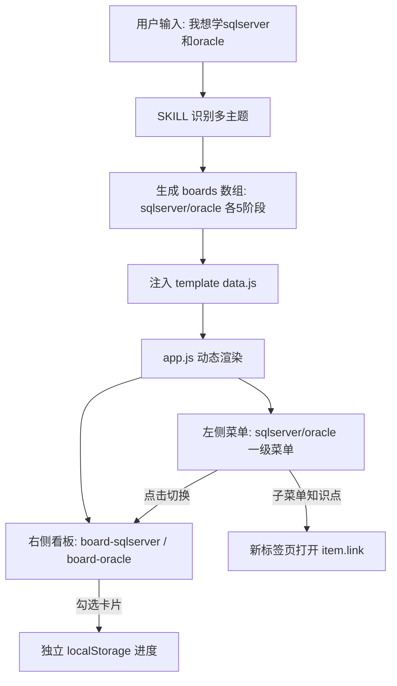

## 用户需求

优化 study-kanban 技能的看板提示词与模板，使其支持多学习主题的菜单切换能力。

## 产品概述

一个代码助手技能（skill），根据用户输入（链接 / 主题描述 / 粘贴素材）自动生成自包含 HTML 学习看板。当前为单一看板，本次优化后：当描述包含多个学习内容时，左侧动态生成多个主题一级菜单（如"sqlserver""oracle"），点击菜单右侧自动切换为对应主题看板；每个一级菜单下保留该主题收集到的知识点子菜单，点击跳转到对应链接。单主题时退化为当前单看板体验。

## 核心功能

- 多主题智能拆分：AI 识别"和/、/与/以及"等分隔符，将多个学习内容拆为独立主题，每个主题生成一个独立看板。
- 左侧动态菜单：每个主题生成一级菜单，点击切换右侧看板；子菜单按阶段分组展示该主题的知识点，点击跳转链接。
- 独立进度存储：每个看板使用独立 localStorage key，进度互不干扰。
- 单主题兼容：仅一个主题时保持现有单一看板结构，左侧只显示一个主题菜单（或无切换）。
- 视觉一致：延续现有蓝色渐变、卡片看板、进度环、浅底深字标签的设计语言。

## 技术栈

- 技能定义：Markdown（SKILL.md frontmatter + 工作流描述）
- 模板技术：原生 HTML + CSS + 原生 JavaScript（无框架，保持自包含、双击可开）
- 数据载体：单文件 `js/data.js` 注入 `boards` 数组（每个元素含独立 stages）
- 进度持久化：localStorage（每个 board 独立 key，沿用 WorkBuddy 的 keyPrefix 机制）
- 视觉规范：复用现有 style.css 的 WorkBuddy 1:1 设计 token

## 实现方案

### 总体策略

将当前"单看板、静态菜单"的模板升级为"配置驱动、动态渲染"的多看板架构，复用 WorkBuddy `js/app.js` 中已验证的 BOARDS 配置 + switchBoard + toggleMenuGroup 设计模式。核心改动三处：(1) SKILL.md 补充多主题拆分规则与新 data schema；(2) template 的 data.js 占位符从 `stages` 改为 `boards` 数组；(3) app.js 改为配置驱动，动态生成左侧菜单组与多个看板容器。

### 关键技术决策

- **数据 schema 升级**：`const boards = __BOARDS_DATA__;`，数组每项 `{ id, title, subtitle, stages:[固定五阶段] }`。单主题时数组长度为 1，UI 自动退化。此设计向后兼容——只需判断 `boards.length` 决定是否渲染切换菜单。
- **动态菜单渲染（关键）**：app.js 启动时遍历 `boards`，为每个 board 生成 `.menu-group`（一级菜单=主题名，子菜单=5 阶段→各知识点链接），并生成对应 `.board` 容器（id=`board-${id}`）。参考 WorkBuddy 的 `switchBoard` 实现互斥显示（其他 board 加 `.hidden`）。
- **进度隔离**：每个 board 独立 storageKey = `study_kanban_progress_${board.id}`，keyPrefix = `${board.id}-`，彻底避免多主题互相覆盖（沿用 WorkBuddy 的 keyPrefix 思路）。
- **子菜单联动**：一级菜单切换时，右侧看板切换 + 左侧子菜单内容自动同步为该主题的知识点（子菜单随一级菜单动态生成，天然满足"只展示当前看板知识点"）。
- **单主题退化**：`boards.length === 1` 时，左侧不显示切换菜单（或只显示一个不可折叠的主题标题），直接渲染该 board，体验与现状一致。

### 性能与可靠性

- 渲染复杂度仍为 O(boards × stages × items)，规模可控（一般 ≤5 主题 ×5 阶段 ×20 项）。
- 复用现有 `escapeHtml` 防止 XSS；知识点链接 href 经校验（必须是 http/https）后输出。
- 进度 key 按 board.id 隔离，旧单看板数据（key=`study_kanban_progress`）不再兼容，但生成的新文件均为 boards 结构，无迁移负担。

## 实现注意事项

- 模板 `js/data.js` 必须保持 `const boards = __BOARDS_DATA__;` 占位符，仅改注释，绝不硬编码示例数据（保持"未填充"约束）。
- index.html 占位符 `__BOARD_TITLE__` / `__BOARD_SUBTITLE__` 保留；若多主题，JS 启动时用 `boards[0]` 的 title/subtitle 填充头部，切换时动态更新。
- style.css 已基本 1:1 复制 WorkBuddy，复用 `.menu-group` / `.menu-item` / `.header` / `.board` 等样式即可，仅需为动态生成的 `.menu-group-items`（三级知识点链接）补充基础链接样式（区别于 `.menu-item` 按钮）。
- app.js 渲染逻辑需向后兼容：无 `boards` 变量时（旧模板）不应报错——生成流程保证总是输出 boards 结构。

## 架构设计

现有单看板数据流升级为：用户输入 → SKILL 工作流（识别多主题 → 拆分为 N 个 board 的 stages）→ 注入 template 的 `boards` → app.js 动态生成菜单组 + 多看板 → 渲染 columns/cards（含 explain）→ 浏览器展示 + 按 board.id 独立 localStorage 进度。



## 目录结构

```
.codebuddy/skills/study-kanban/
├── SKILL.md                       # [MODIFY] 新增多主题识别拆分规则、boards 数据 schema、动态菜单 UI 渲染规则、单主题兼容说明
├── template/
│   ├── index.html                 # [MODIFY] 左侧菜单容器改为 <div id="menuGroupsContainer">；看板区改为 <div id="boardsContainer">；保留操作分组与折叠按钮
│   ├── css/style.css              # [MODIFY] 复用现有 token；新增 .menu-link（三级知识点链接）样式，确认多组菜单堆叠无冲突
│   └── js/
│       ├── data.js               # [MODIFY] 占位符改为 const boards = __BOARDS_DATA__；注释补充 boards 结构说明
│       └── app.js                # [MODIFY] 配置驱动多看板：动态生成菜单组+多 board；实现 switchBoard/toggleMenuGroup/selectMenuItem；进度按 board.id 独立存储；单主题退化
└── output/_example/
    └── js/data.js                 # [MODIFY] 示例数据更新为 boards 数组（可含 2 主题演示多菜单切换）
```

## 关键代码结构

data.js 输出结构（注入点）：

```js
const boards = [
  {
    id: "sqlserver",                       // 主题 slug，用于 DOM id 与 localStorage key 前缀
    title: "SQL Server 学习路线",
    subtitle: "从入门到精通 · 5 阶段、N 个知识点",
    stages: [ /* 固定五阶段，item shape 含 explain 字段 */ ]
  },
  {
    id: "oracle",
    title: "Oracle 学习路线",
    subtitle: "从入门到精通 · 5 阶段、N 个知识点",
    stages: [ /* 同上 */ ]
  }
];
```

## 设计风格

沿用 WorkBuddy 学习看板既有视觉语言（蓝色渐变 header、可折叠侧边栏、进度环、浅底深字 type 标签、横向滚动知识卡列），本次仅改造左侧菜单区为多主题动态菜单，整体视觉保持 1:1 一致。

## 页面区块设计

- 左侧侧边栏（改造重点）：
- 顶部 Logo + "爱学习"标题（不变）
- 动态菜单区 `<div id="menuGroupsContainer">`：每个主题为一组 `.menu-group`，组头显示主题名（如"SQL Server"），组展开后显示 5 个阶段作为二级项，每个阶段下挂该阶段知识点链接（三级 `.menu-link`，点击新标签页打开）
- "操作"分组：返回顶部 / 重置进度（不变）
- 折叠按钮（不变）
- 主区域（不变）：蓝紫渐变 header（标题+副标题+进度环）、图例行、阶段胶囊工具栏、横向滚动看板列。
- 多主题时：点击左侧不同主题组头，右侧看板平滑切换（其他 board 隐藏），header 标题/副标题同步更新，左侧子菜单自动同步为当前主题知识点。
- 单主题时：左侧仅显示一个主题组（不可切换或隐藏切换），体验与现状一致。

## 交互

- 主题组头点击 → switchBoard（互斥展开 + 看板互斥显示 + 头部更新）
- 阶段箭头点击 → 仅折叠/展开该组子菜单（toggleMenuGroup，互斥）
- 知识点链接 → 新标签页打开 item.link
- 卡片勾选 → 更新当前 board 独立进度环

## Agent Extensions

### Skill

- **skill-creator**
- Purpose: 参考该技能关于"如何编写/更新有效 skill"的规范，确保 SKILL.md 的 frontmatter、description 触发语、工作流描述符合最佳实践，特别是新增的多主题拆分规则与数据 schema 描述清晰可执行。
- Expected outcome: SKILL.md 结构合规、触发语覆盖多主题场景、工作流清晰可执行、data schema 与渲染规则明确。