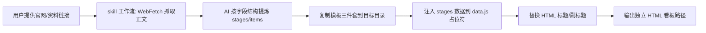

## 用户需求

基于现有 WorkBuddy 看板项目（c:/Users/Administrator/code/KanbanSPA/WorkBuddy）的设计原则与视觉技巧，创建一个名为 "study-kanban" 的 skill 工程，存放于 c:/Users/Administrator/code/KanbanSPA/study-kanban/。后续用户提供一个官网文档链接或资料链接，该 skill 能自动将其转换为风格完全一致的独立看板。

## 产品概述

study-kanban 是一个可复用的 skill 工程，包含 SKILL.md（工作流定义）与一套自包含的看板模板（HTML + style.css + data.js + app.js）。当给定任意学习类官网/资料链接时，skill 通过 WebFetch 抓取正文，由 AI 自动提炼阶段与知识点，注入模板生成一份与原 WorkBuddy 看板视觉风格完全一致的独立 HTML 看板，可直接双击打开或轻量发布。

## 核心功能

- 接收官网/资料链接，自动 WebFetch 抓取正文内容
- AI 按固定卡片字段结构（title/type/desc/criteria/link）自适应推断阶段与知识点粒度
- 套用与 WorkBuddy 一致的视觉模板（蓝系渐变 header、侧边栏、进度圆环、图例、阶段胶囊按钮、卡片与列样式）生成独立 HTML
- 输出自包含三件套到目标目录，并报告生成路径

## 技术栈

- 纯静态前端：HTML + CSS + 原生 JavaScript（与 WorkBuddy 完全一致，无构建步骤）
- Skill 定义：Markdown（SKILL.md，符合 CodeBuddy skill 规范）
- 抓取：WebFetch（skill 工作流中调用，由 AI 完成正文提取与结构化）

## 实现策略

复用 WorkBuddy 的成熟三件套作为模板基底，将其改造为"数据注入式"模板：原 workbuddy-learning-board.html 中的双看板（入门/进阶）结构简化为单看板（study-kanban 面向单一资料源），data.js 暴露 `stages` 数组并由模板占位符注入。style.css 与 app.js 直接复制并裁剪掉 advanced 看板相关分支，保持视觉 1:1 一致。

关键技术决策：

1. 单看板结构：因资料链接通常为单一主题，去掉 WorkBuddy 的 beginner/advanced 双看板切换与侧边栏分组导航，改侧边栏为"资料信息/返回顶部"轻量导航，降低复杂度且保持外观一致。
2. 模板占位符驱动：SKILL.md 规定 data.js 中 `const stages = __STAGES_DATA__;` 为注入点；HTML 中 `<title>`、`.header-left h1`、`.header-left p` 为标题/副标题占位，AI 生成时替换。
3. 自适应 type 标签：保留四种语义标签（reading/hands-on/practice/mastery）配色，但允许 AI 按资料类型选用最合适的子集；color 从 WorkBuddy 调色板（蓝/青/紫/琥珀/粉/绿/红等）中选取并写入 stage.color。

## 性能与可靠性

- 模板为纯静态，无网络依赖、无框架开销，双击即开
- 卡片进度用 localStorage，按 storageKey 隔离不同资料看板，避免串数据
- app.js 裁剪后仅渲染单看板，渲染复杂度 O(stages×items)，资料规模下可忽略

## 实现注意事项

- style.css 需完整复制 WorkBuddy 的 CSS 变量、header/sidebar 渐变、卡片字段、type 标签配色，确保视觉一致；仅移除 `.board-advanced`、双 menu-group 等无用规则
- app.js 移除 BOARDS 双配置、switchBoard、advanced 相关逻辑；保留进度读写、renderBoard、renderStageButtons、toggleCard、一键全选/重置、列与按钮联动、侧边栏折叠
- data.js 仅保留 `const stages = [...]` 与 type 标签映射；结构字段与 WorkBuddy items 完全一致
- SKILL.md 需明确：触发语句、输入（链接）、步骤（抓取→提炼→生成→报告）、输出文件清单、模板占位规则、目录组织方式

## 架构设计



## 目录结构

```
c:/Users/Administrator/code/KanbanSPA/study-kanban/
├── SKILL.md                      # [NEW] Skill 定义。描述触发场景、输入格式、工作流步骤（WebFetch→提炼→生成→报告）、输出文件清单、模板占位符规则（__STAGES_DATA__、标题/副标题）、自适应粒度指引与配色调色板。
├── template/
│   ├── index.html                # [NEW] 看板页面模板。基于 workbuddy-learning-board.html 裁剪为单看板，含标题/副标题占位与 __STAGES_DATA__ 说明注释，引入 css/style.css 与 js/data.js、js/app.js。
│   ├── css/
│   │   └── style.css             # [NEW] 样式模板。复制 WorkBuddy style.css，保留全部视觉规则，移除 advanced 看板与双菜单组无关样式。
│   └── js/
│       ├── data.js               # [NEW] 数据模板。仅保留 `const stages = __STAGES_DATA__;` 占位与 type 标签中文映射，结构同 WorkBuddy items。
│       └── app.js                # [NEW] 逻辑模板。复制 WorkBuddy app.js，裁剪为单看板（移除 BOARDS 双配置、switchBoard、advanced 分支），保留进度/渲染/联动/工具栏逻辑。
```

## 关键代码结构

data.js 注入结构（与 WorkBuddy items 字段一致）：

```js
const stages = [
  {
    id: 1,
    title: "阶段标题",
    subtitle: "阶段副标题 · 类型说明",
    color: "#3b82f6",
    items: [
      { title: "知识点标题", type: "reading", desc: "描述", criteria: "验收标准", link: "https://..." }
    ]
  }
];
```

## 设计风格

完全复用 WorkBuddy 学习看板的成熟视觉体系，确保风格 1:1 一致：蓝色系科技感、清晰阶段化学习路径、卡片式知识点。采用 HTML 单文件 + 外部 css/js 模板结构。

## 页面区块设计（单看板）

1. 顶栏 Header：135deg 蓝系渐变背景，左侧标题+副标题，右侧半透明毛玻璃进度圆环（conic-gradient）显示总进度与知识点计数。
2. 图例 Legend：四色 type 标签说明（阅读理解/动手实操/练习巩固/综合应用），与卡片标签配色呼应。
3. 工具栏 Toolbar：顶部胶囊阶段按钮（按阶段色高亮）+ 右侧一键全选/重置进度按钮。
4. 看板 Board：横向滚动容器，每列 220px 宽、顶部 3px 阶段色边框，列内含阶段编号徽章、计数；卡片含勾选框+标题、type 标签、描述、验收标准（左色边框）、查看文档链接。
5. 侧边栏 Sidebar：180deg 蓝系渐变，可折叠，含资料信息卡与返回顶部入口，保持与 WorkBuddy 一致的可折叠交互。

## 交互

卡片点击勾选→进度实时更新并 localStorage 持久化；阶段按钮与看板列双向联动高亮；悬停卡片上浮、列描边阶段色；一键全选/重置带确认。

## Agent Extensions

### Skill

- **skill-creator**
- Purpose: 指导按 CodeBuddy skill 规范编写 study-kanban 的 SKILL.md（触发条件、输入输出、工作流、模板占位规则）
- Expected outcome: 生成符合规范、可被正确识别与调用的 SKILL.md 定义文件

### SubAgent

- **code-explorer**
- Purpose: 在生成模板前精确核对 WorkBuddy 三件套中需保留/裁剪的代码段与样式规则，避免风格偏差
- Expected outcome: 明确 app.js/style.css 中 advanced 看板相关分支与可安全复用的视觉规则清单