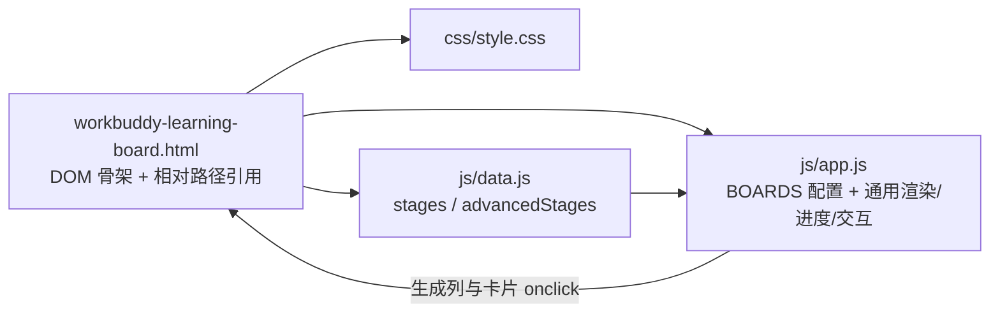

## 用户需求

对 WorkBuddy/workbuddy-learning-board.html 进行架构优化：将内联的 HTML、CSS、JS 拆分为独立文件各自存储，引用采用相对路径，并对其中无效代码做重构和删减。

## 产品概述

WorkBuddy 学习路线看板是单文件静态页面应用，包含「入门指南」（7 阶段 28 项）与「进阶指南」（25 阶段 100+ 项）两个可切换看板，以列（阶段）+ 卡片（知识点）形式展示学习路线，支持勾选完成、一键全选、重置进度、环形进度百分比展示、localStorage 持久化与侧边栏文档导航。

## 核心功能

- 结构拆分：HTML/CSS/JS 三分离为独立文件，相对路径引用，保持 file:// 直接打开可用
- 无效代码清理：删除无 JS 引用的 tooltip 元素与样式、无对应元素的 .stats-bar 残留、被内联样式覆盖的 .stage-N 规则、switchBoard 空分支、未使用的 headerEl 参数、冗余局部变量等
- 重复逻辑重构：将 beginner/advanced 两套高度重复的渲染、进度、滚动、切换逻辑合并为配置驱动的通用实现
- 行为与视觉零变化：保留全部 DOM id、localStorage key、外部链接、双向滚动联动与交互行为

## 技术选型

- 原生 HTML5 + CSS3 + ES6 JavaScript，无构建工具、无第三方依赖，保持静态文件直开
- 经典脚本（非 ES module）：因 ES module 在 file:// 协议下受 CORS 限制，经典脚本可保证页面双击直接打开时功能完整
- 拆分产物：`WorkBuddy/css/style.css`、`WorkBuddy/js/data.js`、`WorkBuddy/js/app.js`

## 实现方案

采用「数据与逻辑分离 + 配置驱动」策略：体积最大的数据数组（约 900 行）原样迁入 data.js；app.js 通过 BOARDS 配置对象（boardId / colPrefix / storageKey / stages / currentStage）泛化渲染与交互函数，合并两套重复逻辑（renderBoard/renderAdvancedBoard、updateProgress/updateAdvancedProgress、scrollToStage/scrollToAdvStage、toggleCard/toggleAdvCard、load/saveProgress 系列、completeAll/resetAll 分支等），预计消除约 40% 重复 JS。动态生成的 HTML 中 onclick 改为携带 board 类型的签名（如 `toggleCard('beginner', 1, 0)`），静态 HTML 中仅将 switchBoard 调用去掉未使用的 `this` 参数，其余内联事件保持不变，最大限度降低行为回归风险。

### 死代码清理清单（已逐行核验）

- 删除 `.tooltip` CSS 与 `<div id="tooltip">`（JS 全文无任何引用）
- 删除 CSS 注释 `/* Stats bar (removed ...) */` 及 @media 中 `.stats-bar` 选择器（无对应元素）
- 删除 `.stage-1`~`.stage-7 .stage-badge` 颜色规则（渲染时已用内联 `background` 覆盖，永不生效），同步移除生成列时多余的 `stage-N` class
- 合并重复的 `.sidebar.collapsed .sidebar-toggle` 规则（第 492 与 537 行）
- 简化 switchBoard 中"已展开则保持"的空 if/else 分支；删除未使用的 headerEl 参数
- 删除冗余局部变量 escapedColor；删除旧的 currentBeginnerStage/currentAdvancedStage、progress/advProgress 独立声明，改由配置与统一 store 管理

## 实施要点

- 加载顺序固定：data.js 必须先于 app.js（stages/advancedStages 为全局词法绑定，供 app.js 引用）
- localStorage key 保持不变：`workbuddy_learning_progress`、`workbuddy_advanced_progress`
- 全部 DOM id 保持不变（board、board-advanced、stageButtons、progressCircle、progressText、progressDetail、sidebar、header-guide、header-advanced、group-guide、group-advanced）及生成的列 id（stage-col-N / adv-stage-col-N）
- 保留 scroll 双向联动、suppressScrollSyncUntil 防抖、菜单组互斥折叠、菜单项 active 记忆等既有行为
- 渲染仍为 innerHTML 整体重绘（约 130 张卡片），与原行为一致，不做性能优化以免扩大改动面
- 影响面仅限目标 HTML 与新增的 css/js 文件，不触碰 LICENSE 与 .codebuddy 目录

## 架构设计

模块关系（经典脚本按序加载，全局函数供内联 onclick 调用）：



数据流：data.js 提供数据 → app.js 依 BOARDS 配置读取数据并按当前看板渲染 → 用户点击经全局函数更新 progressStore → 写回 localStorage 并重渲染 + 更新进度。

## 目录结构

```
WorkBuddy/
├── workbuddy-learning-board.html  # [MODIFY] 仅保留 DOM 骨架：删除 <style>/<script>，按序引入 css/style.css、js/data.js、js/app.js，调整 switchBoard 内联调用签名
├── css/
│   └── style.css                  # [NEW] 全部样式（约 700 行），按清理清单删除无效规则后原样迁移
└── js/
    ├── data.js                    # [NEW] stages 与 advancedStages 两个数据数组，原样迁移，不改任何内容
    └── app.js                     # [NEW] BOARDS 配置 + 通用渲染/进度/滚动/切换/侧边栏逻辑，含 init 调用
```

## 关键代码结构

```js
// app.js 核心配置（data.js 先加载，提供 stages/advancedStages）
const BOARDS = {
  beginner:  { boardId: 'board',         colPrefix: 'stage-col',    storageKey: 'workbuddy_learning_progress', stages, currentStage: 1 },
  advanced:  { boardId: 'board-advanced', colPrefix: 'adv-stage-col', storageKey: 'workbuddy_advanced_progress', stages: advancedStages, currentStage: 1 }
};
const progressStore = { beginner: {}, advanced: {} };
let currentBoard = 'beginner';

// 通用函数签名（按 board type 参数化）
function loadProgress(type) {}
function saveProgress(type) {}
function isDone(type, stageId, idx) {}
function getStageDone(type, stage) {}
function getTotalDone(type) {}
function getTotalItems(type) {}
function updateProgress(type) {}
function renderBoard(type) {}
function renderStageButtons() {}
function toggleCard(type, stageId, idx) {}
function onStageClick(type, id) {}
function onColumnClick(type, id) {}
function highlightActiveColumn(id) {}
function scrollToStage(type, id) {}
function syncStageFromScroll() {}
function switchBoard(type) {}
function completeAll() {}
function resetAll() {}
```

## Agent 扩展

### SubAgent

- **code-explorer**
- 用途：对目标 HTML 做全量交叉引用审计，核对所有内联 onclick 函数名、getElementById 的 id、CSS class 选择器是否均有对应定义/元素，输出存活引用与死代码清单
- 预期结果：得到一份可执行的清理清单，确保删除 tooltip、stats-bar、stage-N 等死代码不会破坏任何功能

### Skill

- **playwright-cli**
- 用途：重构完成后对页面做冒烟测试，加载页面、检查控制台无报错、验证勾选卡片/切换看板/一键全选/重置进度等交互与 localStorage key 前后一致
- 预期结果：输出验证结论，确认拆分重构后行为与视觉零回归